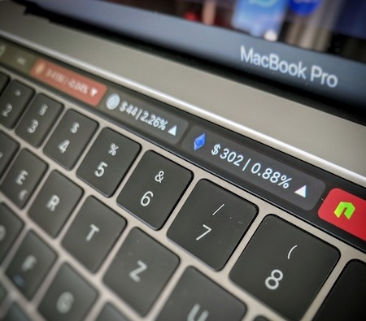

# touchbar-cryptocoins
View BTC, LTC, ETH and NEO on your Macbook Touchbar.

## Install

1. Install the BetterTouchTool: https://www.boastr.net/downloads/
2. Import the  [crypto_preset_config.json](crypto_preset_config.json) via "Manage Presets" > "Import"

